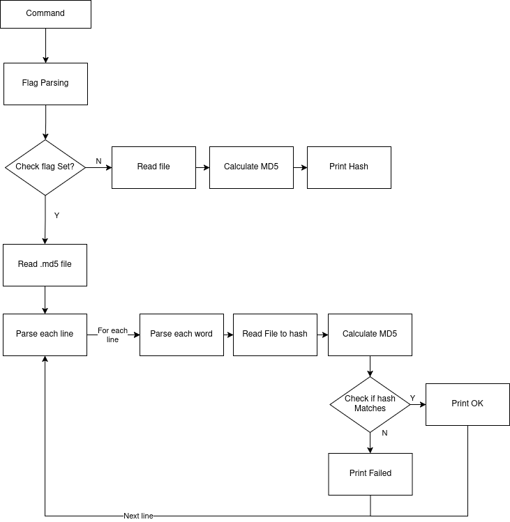
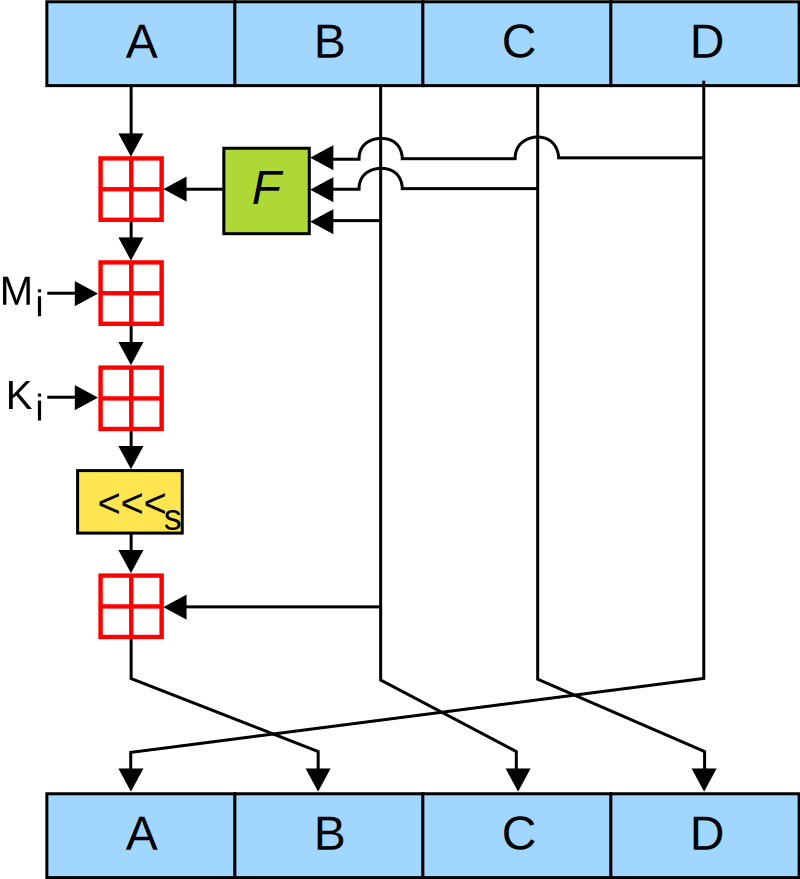
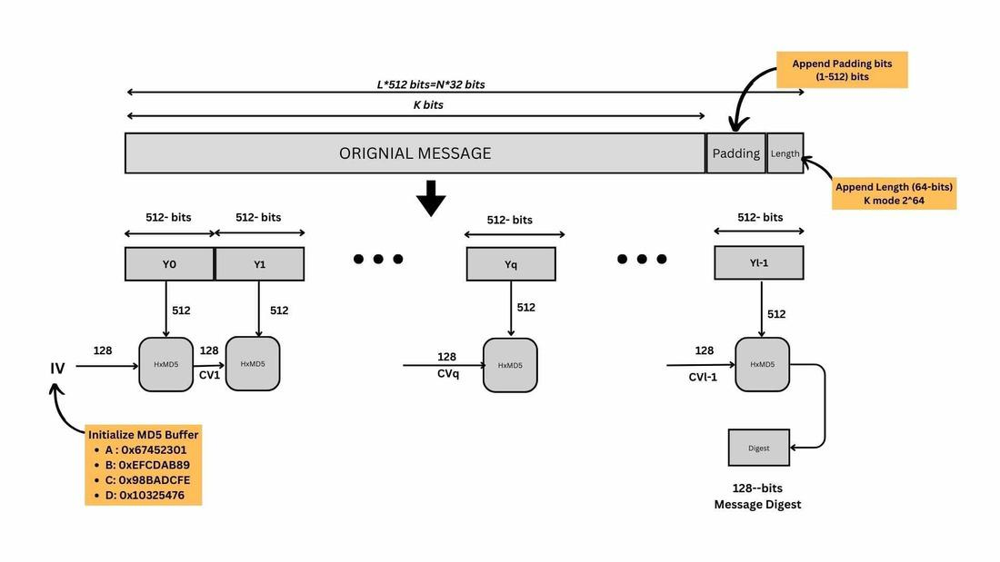

# WARNING CURRENTLY THE CALCULATION IS WRONG. BUT THE REST WORKS.

# md5sum
md5sum ([RFC1321](rfc1321.txt)) in Haskell


## Usage

The usage is the same as for the common GNU md5sum version with some exceptions.

Currently, the only working flag is ```-c``` as the ```--text``` and
```--binary``` flags are not used on Unix systems.

###Example:

Get MD5 hash from the file ```foo.bar```
```bash
$ md5sum foo.bar
dd32876efbff8edb1a41f81b9b0fc57b  foo.bar
```
Use md5 file to check a list of files

```bash
$ md5sum -c foo.md5
foo.bar: OK
```
    
## Inner workings






## References


- [RFC1321](rfc1321.txt)
- hoogle
- [hackage](https://hackage.haskell.org/)
